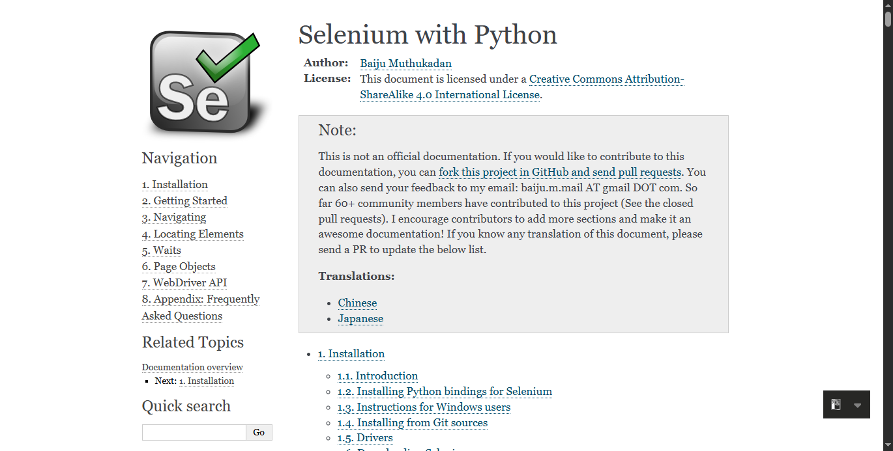

# 🔎 Google Search Automation using Python + Selenium

This project automates a Google Search using Python, bypasses CAPTCHA, simulates human typing, clicks the first result, and takes a screenshot of the opened page.

---

## 🚀 Features
- Undetectable Chrome automation (`undetected-chromedriver`)
- Human-like search typing
- CAPTCHA-safe
- Screenshot capture
- Clean browser session with graceful exit

---

## 🧰 Tech Stack
- Python 3.11
- Selenium 4
- undetected-chromedriver
- PyCharm

---

## ▶️ How to Run

1. Install dependencies:
    ```bash
    pip install -r requirements.txt
    ```

2. Run the script:
    ```bash
    python main.py
    ```

3. Output:
    - Title and URL printed in terminal
    - Screenshot saved in `/screenshots/result_page.png`

---

## 📸 Screenshot


---

## 🤝 Author
**Muhammad Arfan Wazeer**  
LinkedIn: [[Your LinkedIn Profile Link](https://www.linkedin.com/in/muhammad-arfan-wazeer-543468a2/)]  
